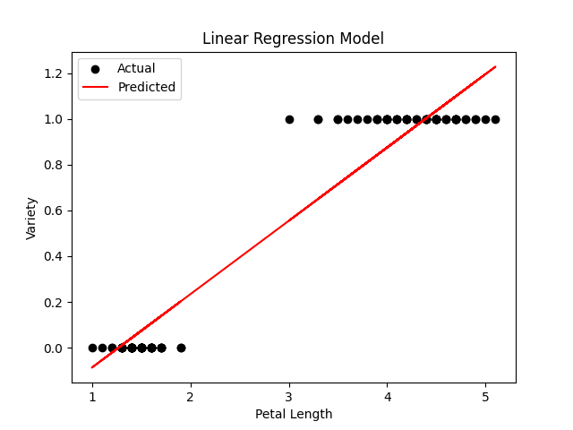
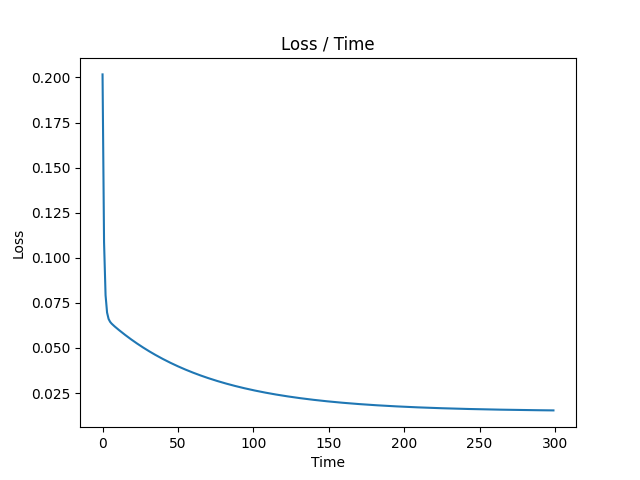

# MALIS Project 1
### Written by: Qizhi Pan and Joel Brown
### Date: November 4, 2024

## Task 1 - Binary Classifier  
###  Problem Definition 
We want to design a model that will predict between a Setosa and a Versicolor using data on their petals' and stalks' length and width. 

The initial data set `iris.csv` contained data on 3 flowers but we have reformatted it to have just the first 2 flowers for this task and renamed it `iris_binary.csv`

### Analysis of Dataset
In our task1.py, the first thing we did was create a `matplotlib` function to show us a scatterplot of the data. 

#### Structure of the Scatterplot

For a dataset with 4 features (e.g., `sepal.length`, `sepal.width`, `petal.length`, and `petal.width`), the pairplot grid looked like this:

|                   | `sepal.length` | `sepal.width`  | `petal.length`  | `petal.width`  |
|-------------------|----------------|----------------|-----------------|----------------|
| **`sepal.length`** | Histogram      | Scatter Plot   | Scatter Plot    | Scatter Plot   |
| **`sepal.width`**  | Scatter Plot   | Histogram      | Scatter Plot    | Scatter Plot   |
| **`petal.length`** | Scatter Plot   | Scatter Plot   | Histogram       | Scatter Plot   |
| **`petal.width`**  | Scatter Plot   | Scatter Plot   | Scatter Plot    | Histogram      |

This layout provides a **comprehensive overview** of all pairwise relationships in the dataset.

For the categories we choose(`Setosa`, `Versicolor`), we can see that the distributions of `petal.length` or `petal.width` has distinct boundary between 2 categories and other features are more or less overlapped. 

Theoreticlly, either the `petal.length` or `petal.width` itself should be enough to differentiate between these 2 categories. In **task 1**, we decided to only use `petal.length` to create a regression model.

#### Why use this scatterplot ?

This layout provided a comprehensive overview of all pairwise relationships in the dataset, here we can see that `petal.length` is enough to differentiate between the 2 iris flowers. So we decided to use just this feature to create a regression model.

This significatnly reduces the complexity of the model, making it easier to understand and implement. However, it is to note that, this may come back to bite us. 

### Model

In this project, we implemented a regression model in Python to classify flowers as either *Setosa (0)* or *Versicolor (1)* based on the feature `petal.length`. The model is based on the hypothesis stemming from our scatterplot, that a linear relationship of the form $y = wx + b$ exists, where:

- `y` - the predicted value.
-  `w` and `b`- the parameters to be learned.

In the end, the classification will be:

- If `y <0.5`, classify *Setosa (0)*
- f `y >=0.5`, classify *Versicolor (1)*

We defined the Mean Squared Error (MSE) as the loss function to quantify how accurately the model predicts the target values. To optimize the model parameters (`w` and `b`), we implemented Gradient Descent, which minimizes the loss function by iteratively updating the parameters as follows:

$w=w−\alpha⋅\frac{∂w}{∂Loss}​$

$b=b−\alpha⋅\frac{∂b}{∂Loss}​$ 

where $\alpha$ is the learning rate (defaulted to 0.01 arbituarly)

We define `w` and `b` as 0 initially, and for each epoch, the model calculates the gradient, computes the loss, then updates the parameters. We also log the loss in an array for troubleshooting analysis.

The model trains itself over 300 epochs, optimizing `w` and  `b` to decrease the loss. After which, the new trained parameters are used and the 0.5 threshold is applied to correctly classify between *Setosa (0)* and *Versicolor (1)*

### Visualizing the Results

#### Linear Regression Model

The plot shows how the predicted class labels depend on petal.length

- A red line represents the model’s decision boundary (y=0.5y=0.5), dividing the two classes (Setosa and Versicolor)
- Data points below the line are classified as Setosa, and those above are classified as Versicolor

#### Loss Function

The loss function seemed to smooth out at a local minimum, indicating the model is performing well over the epochs.

### Evaluating the Model

To evaluate the model’s performance, we used the following metrics:

- Accuracy: 1.0
  - Measured the proportion of correct predictions across the test dataset.
  - The model achieved **100% accuracy**, correctly predicting the class (Setosa or Versicolor) for all test samples

- Confusion Matrix:
$$
\begin{pmatrix}
  50 & 0  \\
  0 & 50  \\
\end{pmatrix}
$$
Provided a summary of 50 true positives, 0 false positives, 50 true negatives, and 0 false negatives.

- Classification Report:
      Includes precision, recall, and F1-score for each class, giving a comprehensive view of the model’s performance.

  - **Precision**: 1.00 for both classes (0 and 1), indicating no false positives.
  - **Recall**: 1.00 for both classes, meaning no false negatives.
  - **F1-Score**: 1.00, demonstrating a perfect balance between precision and recall.

### **Conclusion**
The model performed perfectly on the test dataset, achieving 100% accuracy across all evaluation metrics. While this is an excellent result, it is worth noting that such perfect performance might be **specific to this dataset** and **may not generalize to new or unseen data**. 

In this task, we only used one feature `petal.length` out of the 4 available features to classify the flowers. 

In the next task, we will explore multi-variable classification, where the dimensions of the dataset will have to increase as we incorporate additional features. 