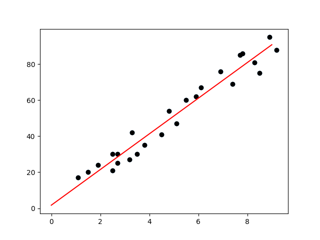

## Overview

You’ve created a linear regression model to predict Scores based on StudyHours using gradient descent to minimize the cost function. The goal is to find the line (defined by slope `m` and intercept `b`) that best fits the data.

Here’s a breakdown of each concept and how your code implements it.
## Linear Regression Model

The core model is based on a linear equation:

$\hat{y}$ = $b + m x_1$
    

where:

- y: Predicted score.
- x: Study hours.
- m: Slope (determines the steepness of the line).
- b: Intercept (the point where the line crosses the y-axis).

In linear regression, we want to find the values of mm and bb that give the best predictions of Scores based on StudyHours.
## Cost Function

The cost function measures how well our model’s predictions match the actual data. In this case, you used the Mean Squared Error (MSE), which is a common cost function in regression. It’s defined as:

MSE = $\frac{1}{n} \Sigma_{i=1}^n({y}-\hat{y})^2$

where:

- N: Number of data points.
- yi​: Actual value of Scores.
- m⋅xi+bm⋅xi​+b: Predicted value based on StudyHours using the current values of mm and bb.

In your code, the cost function calculates the squared difference between actual scores and predicted scores, then averages this error over all points. The lower the MSE, the better the line fits the data.
## Gradient Descent

Gradient descent is an optimization algorithm used to find the values of mm and bb that minimize the cost function. The basic idea of gradient descent is to iteratively adjust mm and bb by moving in the direction that reduces the cost function.

- Gradient: The gradient of the cost function with respect to mm and bb tells us how much the cost function changes when we tweak mm or bb. 
    - It points in the direction of steepest ascent, so we take the opposite direction to minimize the cost.

- Partial Derivatives:
    - For m: The partial derivative of the cost function with respect to mm tells us how to adjust mm to decrease the error.
    - For b: The partial derivative with respect to bb tells us how to adjust bb to decrease the error.

1. **Partial derivative with respect to \( m \)**:

   $\frac{\partial \text{MSE}}{\partial m} = -\frac{2}{N} \sum_{i=1}^{N} x_i \cdot (y_i - (m \cdot x_i + b))$

2. **Partial derivative with respect to \( b \)**:

   $\frac{\partial \text{MSE}}{\partial b} = -\frac{2}{N} \sum_{i=1}^{N} (y_i - (m \cdot x_i + b))$

## Implementing Gradient Descent in Your Code

Here’s how your gradient_descent function works:

- Initialize Gradients: m_gradient and b_gradient start at 0 and accumulate adjustments for each data point.
- Loop Over Data Points: For each data point, calculate the error based on the current values of mm and bb and adjust m_gradient and b_gradient.
- The adjustments are scaled by (2/n) to normalize the gradients.
- Update mm and bb: After summing the gradients for all points, you update mm and bb by subtracting m_gradient * L and b_gradient * L, where LL is the learning rate.
- The learning rate controls the step size. A small LL leads to smaller, more precise steps, while a large LL can overshoot the minimum.

## Minimizing the Cost Function

Each iteration of gradient descent adjusts mm and bb slightly to reduce the MSE. This process is repeated (here, for 300 epochs), gradually “descending” down the slope of the cost function until it reaches a point where further adjustments have little effect on the error.
## Visualizing the Result

After gradient descent, the model plots the best-fit line with the optimized mm and bb:

The scatter plot shows the actual data points (StudyHours vs. Scores)

The line plot represents the predictions made by your optimized linear regression model.

## Summary of Key Concepts

- Cost Function (MSE): Measures how well our line fits the data. We want to minimize this.
- Gradient Descent: An optimization algorithm that iteratively adjusts mm and bb to reduce the cost function.
- Learning Rate: Controls the step size in gradient descent.
- Result: A line that best fits the data, providing a simple model to predict scores based on study hours.