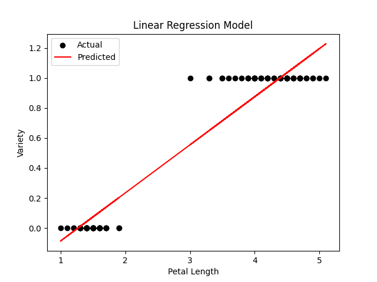
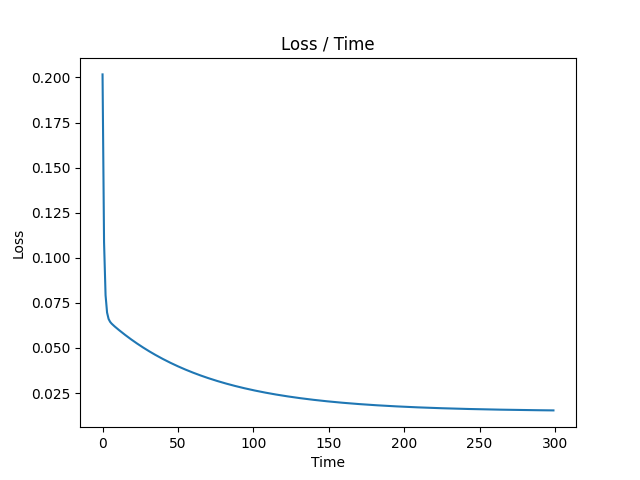
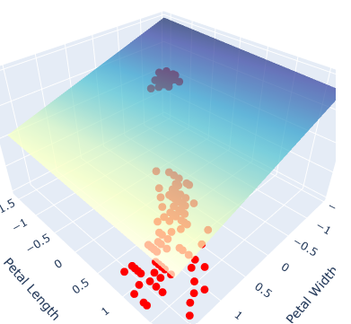
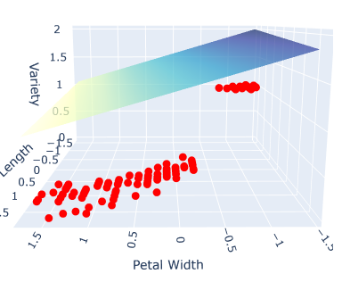
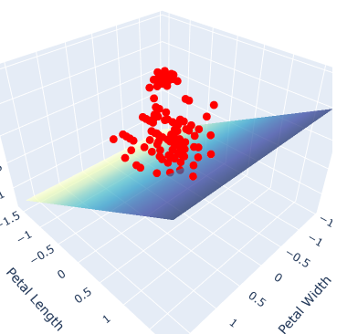
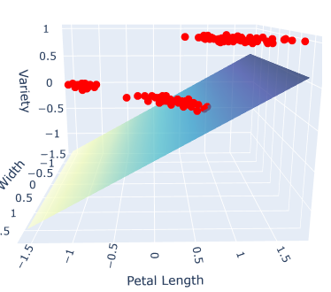
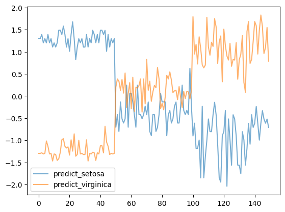

# MALIS Project 1

Written by: Qizhi Pan and Joel Brown
Date: November 4, 2024
## 1. Introduction
### 1.1 Overview
In this project, we completed a binary classification task using linear regression based on iris dataset and further, completed a ternary classification task. The accuracy for task 1 can be 100%, and for task 2 can be up to 96%. 
### 1.2 ChatGPT Usage
We used ChatGPT to accelarate our coding, complete and revise our code. We originally proposed a solution to the ternary classification problem and implemented it using ChatGPT.
## 2. Dataset Description and Analysis
The Iris dataset consists of 150 samples, each representing a flower of one of three species: `Setosa`, `Versicolor`, and `Virginica`. The dataset contains 4 numerical features:`sepal.length`, `sepal.width`, `petal.length`, and `petal.width`, all of them are in centimeters.

The dataset is balanced, with 50 samples per class. Each sample is labeled with one of three classes corresponding to the flower species.

To better handle the classification task with linear regression, we need to understand the data.

### 2.1 Plot 4 Features in 2 Categories
 Considering the binary classifier in **task 1**, here we list the scatterplots and histograms for 4 features in selected 2 categories:

Here's the definition for each pairplot grid:

|                   | `sepal.length` | `sepal.width`  | `petal.length`  | `petal.width`  |
|-------------------|----------------|----------------|-----------------|----------------|
| **`sepal.length`** | Histogram      | Scatter Plot   | Scatter Plot    | Scatter Plot   |
| **`sepal.width`**  | Scatter Plot   | Histogram      | Scatter Plot    | Scatter Plot   |
| **`petal.length`** | Scatter Plot   | Scatter Plot   | Histogram       | Scatter Plot   |
| **`petal.width`**  | Scatter Plot   | Scatter Plot   | Scatter Plot    | Histogram      |

This layout provides a **comprehensive overview** of all pairwise relationships in the dataset.

For the categories we choose(`Setosa`, `Versicolor`), we can see that the distributions of `petal.length` or `petal.width` has distinct boundary between 2 categories and other features are more or less overlapped. 

Theoreticlly, either the `petal.length` or `petal.width` itself should be enough to differentiate between these 2 categories. In **task 1**, we decided to only use `petal.length` to create a regression model.

### 2.2 Plot 4 Features in 3 Categories
Considering the ternary classifier in **task 2**, here we plot the 4 features in 3 categories with the same grid definition as above:

In this new condition, choosing only one feature to set up the model is not a good idea, because every feature overlaps with each other to some extent. But the `petal.length` and `petal.width` together show a beautiful linear relationship with more feasible boundaries to distinguish each other.

Thus, in task 2, we decide to use both `petal.length` and `petal.width` features to create our regression model.
## 3. Experiments
### 3.1 Task 1 - Binary Classifier  
In this project, we implemented a regression model in Python to classify flowers as either *Setosa (0)* or *Versicolor (1)* based on the feature `petal.length`. The model is based on the hypothesis stemming from our scatterplot, that a linear relationship of the form $y = wx + b$ exists, where:

- `y` - the predicted value.
-  `w` and `b`- the parameters to be learned.

In the end, the classification will be:

- If `y <0.5`, classify *Setosa (0)*
- f `y >=0.5`, classify *Versicolor (1)*

We defined the Mean Squared Error (MSE) as the loss function to quantify how accurately the model predicts the target values. To optimize the model parameters (`w` and `b`), we implemented Gradient Descent, which minimizes the loss function by iteratively updating the parameters as follows:

$$w=w−\alpha⋅\frac{∂w}{∂Loss}​$$

$$b=b−\alpha⋅\frac{∂b}{∂Loss}​$$ 

where $\alpha$ is the learning rate (defaulted to 0.01 arbituarly)

We define `w` and `b` as 0 initially, and for each epoch, the model calculates the gradient, computes the loss, then updates the parameters. We also log the loss in an array for troubleshooting analysis.

The model trains itself over 300 epochs, optimizing `w` and  `b` to decrease the loss. After which, the new trained parameters are used and the 0.5 threshold is applied to correctly classify between *Setosa (0)* and *Versicolor (1)*

### Visualizing the Results

#### Linear Regression Model

The plot shows how the predicted class labels depend on petal.length

- A red line represents the model’s decision boundary (y=0.5y=0.5), dividing the two classes (Setosa and Versicolor)
- Data points below the line are classified as Setosa, and those above are classified as Versicolor

#### Loss Function

The loss function seemed to smooth out at a local minimum, indicating the model is performing well over the epochs.

### Evaluating the Model

To evaluate the model’s performance, we used the following metrics:

- Accuracy: 1.0
  - Measured the proportion of correct predictions across the test dataset.
  - The model achieved **100% accuracy**, correctly predicting the class (Setosa or Versicolor) for all test samples

- Confusion Matrix:
$$
\begin{pmatrix}
  50 & 0  \\
  0 & 50  \\
\end{pmatrix}
$$
Provided a summary of 50 true positives, 0 false positives, 50 true negatives, and 0 false negatives.

- Classification Report:
      Includes precision, recall, and F1-score for each class, giving a comprehensive view of the model’s performance.

  - **Precision**: 1.00 for both classes (0 and 1), indicating no false positives.
  - **Recall**: 1.00 for both classes, meaning no false negatives.
  - **F1-Score**: 1.00, demonstrating a perfect balance between precision and recall.

### **Conclusion**
The model performed perfectly on the test dataset, achieving 100% accuracy across all evaluation metrics. While this is an excellent result, it is worth noting that such perfect performance might be **specific to this dataset** and **may not generalize to new or unseen data**. 

In this task, we only used one feature `petal.length` out of the 4 available features to classify the flowers. 

In the next task, we will explore multi-variable classification, where the dimensions of the dataset will have to increase as we incorporate additional features. 
### 3.2 Task 2 - Ternary Classifier  
#### 3.2.1 Solution
We can still use the previous binary classification to solve the ternary classification task. In this case, two binary classifiers are need. As discussed in 2.2, we need to train new models using  `petal.length` and `petal.width`.

Here's the solution:

1. We train two models. Let's say A and B. A tells `Setosa` from the rest. B tells `Virginica` from the rest.
2. When we classify one sample, we put it into both A and B and get their predict values $y_{A_{pre}}$, $y_{B_{pre}}$.
3. If $y_{A_{pre}} > y_{B_{pre}}$ and $y_{A_{pre}}>$ a threshold, then we classify this sample to `Setosa`. If $y_{B_{pre}} > y_{A_{pre}}$ and $y_{B_{pre}}>$ a threshold, then we classify this sample to `Virginaca`. If $y_{A_{pre}}$, $y_{B_{pre}}$ both less than the threshold, we classify this sample to `Versicolor`. In our practice, we set the threshold to be 0.75.
#### 3.2.2 Models
Model A:
$$y_{A_{pre}}=W_A^T X + b_A$$
$$W_A = [w_{A1},w_{A2}],X = [x_1,x_2]​$$
Model B:
$$y_{B_{pre}}=W_B^T X + b_B$$
$$W_B = [w_{B1},w_{B2}],X = [x_1,x_2]​$$

#### 3.2.3 Training, Testing and Results
The training procedure in task 2 is quite similar to task 1. The slight changes are:
1. In the data preprocessing, to train model A, we set all target `Setosa` to value `1`, the rest to `0`. While trainig model B, we set all target `Versicolor` to value `1`, the rest to `0`.
2. The expression of gradient decends are different in forms.
3. The regression model we get here is a plane, not a line as in task 1.
   
One important change that we do here is we start to use the valid set to reject the trained model. In task 1, the model is too simple, we're able to get a good model without using the valid set. But in the practice in doing task 2, we have  to use the valid set to make sure that we get a good model.

One result in a successful training is like:
Model A:
$$[w_{A1},w_{A2}]= [-0.2971,-0.0644], b_A = 1.5450$$

Model B:
$$[w_{B1},w_{B2}]= [0.0265,  0.5822], b_B = -0.4908$$

Then we use the whole iris dataset to do the classification based on 3.2.1.

Predicted label:

Classification result:

Total samples: 150
Number of misclassifications: 6
Accuracy: 96.00%
## 4. Discussion
### 4.1 About Models
#### 4.1.1 More features?
In task 1, we only use 1 feature and in task 2, we only use 2 features. Theoretically, we could use 4 features together to train the model in one time and still get ideal result. But just as discussed in 3.2.3, the trained model can be more unstable and requires some well-designed use of valid set.
#### 4.1.2 Other Forms of Model?
In this report, we use $y = WX+b$ model till the end. Actually, in the first trail in task 2, we tried to use $z = a·(x+y)^2 + b·(x+y) + c$ to do the linear regression, cause we try to handle the scenario when `Versicolor` set to 1 in the middle and the rest to 0. It turns out that this kind of model can be super correct when it's well trained, but it's also very hard to train it right.

Here we knows "esay to train" is also a very good trait for a model.
### 4.2 About Pros and Cons
#### 4.2.1 Pros
1. It's simple to implement
2. The computation cost is low

#### 4.2.2 Cons
1. Linear regression is not inherently designed for classification tasks, leading to suboptimal decision boundaries(like what we observed in 2.2)
2. When the data distributions show non-linear properties, it will be hard to implement
3. For more categories to be classified, it needs more tricks and may results in limited performance.
